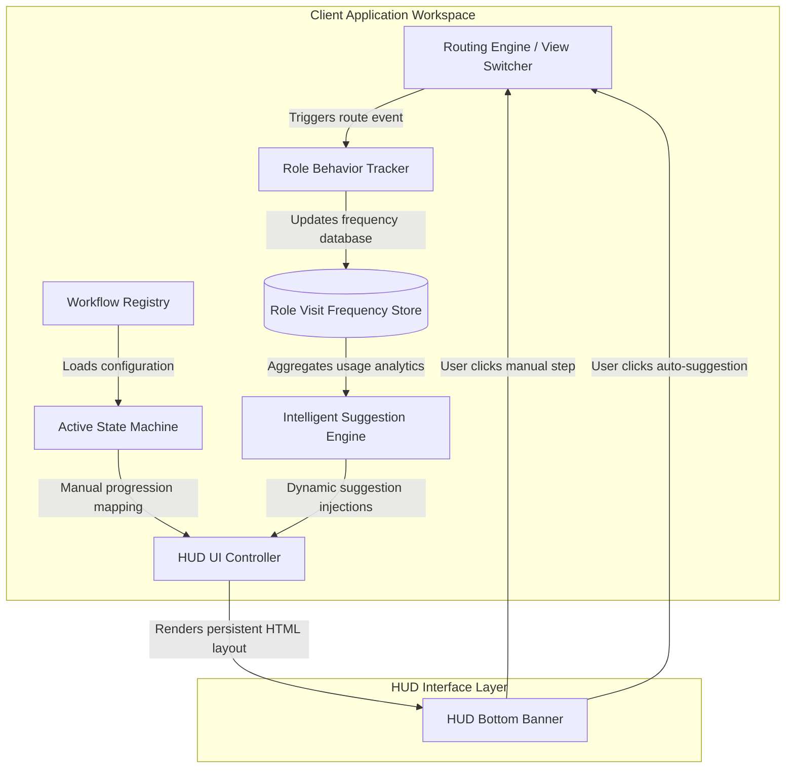

# Heads-Up Display (HUD) Cross-Module Navigation for Enterprise Resource Planning (ERP) Systems

## A Prior Art Specification and Proof-of-Concept (PoC) Documentation
**Author & Inventor:** Greejesh Prakash  
**Date of Origin:** June 2026  

This repository contains the conceptual design, architectural blueprints, and a fully functional frontend Proof-of-Concept (PoC) for a **Heads-Up Display (HUD) Cross-Module Navigation System** tailored for Enterprise Resource Planning (ERP) suites. 

This document serves as a formal public disclosure and prior art declaration to establish intellectual property boundaries and prevent future patenting of this system design by third parties.

---

## 1. Technical Abstract
Traditional Enterprise Resource Planning (ERP) systems (covering finance, logistics, HR, inventory, etc.) are notorious for highly nested menu architectures, disjointed module structures, and heavy cognitive loads. Standard operations frequently require cross-departmental, multi-step workflows. For example, executing a daily check-out or audit requires users to open an accounting ledger, verify sales invoices, compile day books, and cross-reference trial balances. In existing systems, executing this sequence forces the user to manually exit modules, browse deeply nested tree menus, search for page names, or manage multiple browser tabs. This leads to:
1. **Context-Switching Fatigue**: Users lose track of the workflow's overall state.
2. **Operational Error Rates**: Lack of sequential gating increases human mistakes.
3. **Training & Onboarding Bottlenecks**: New operators struggle to memorize pathing sequences.

To address these vulnerabilities, this project introduces a **Persistent overlay-based Heads-Up Display (HUD) Cross-Module Navigation Wizard** combined with **Intelligent Role-Based Behavior Auto-Mapping**. The HUD is an omnipresent, floating navigation interface that persists across global routing state changes. It provides:
1. **Linear Workflow State Gating**: Guides users step-by-step through distinct functional modules, maintaining process state, steps completed, and contextual validations.
2. **Behavioral Role Profiling**: A passive tracking engine monitors navigation frequencies relative to organizational roles.
3. **Dynamic Suggestion Injection**: An intelligent recommendation algorithm dynamically merges administrative-defined sequences with behavior-mapped shortcuts, presenting context-aware recommendations inside the HUD without disrupting manual workflows or database schemas.

---

## 2. Core Architectural System Design

The architecture coordinates five main structural layers:
1. **Routing and View Engine**: Manages transition rendering between different ERP views/modules.
2. **Role Behavior Tracker**: Hooks into the router to monitor and record screen hits per user role.
3. **Workflow and Rule Registry**: Stores administrative-defined pipelines, including associated steps, module lists, and role assignments.
4. **Intelligent Suggestion Engine**: Analyzes logged metrics to extract recommended views.
5. **HUD UI Controller (Overlay)**: Dynamically renders the state-preserved persistent footer bar.



---

## 3. Technical Specifications

### A. Persistent HUD Interface & State Preservation
The HUD is implemented as a fixed, overlay container positioned at the edge of the viewport (e.g., bottom banner or top-right quadrant). It operates as a global React, Vue, Angular, or Vanilla JS component that is independent of individual workspace modules.

- **State Persistence**: The HUD state machine maintains:
  - `activeWorkflowId`: Identifies the executing pipeline.
  - `currentStepIndex`: Integer marking the current position in the sequence.
  - `workflowHistory`: Array recording historical route execution.
  - `isCompleted`: Boolean showing if all gates are validated.
- **Glassmorphism Backdrop**: The HUD utilizes CSS styling properties to achieve visual harmony:
  - Variable opacity (defaulting to `0.5` opacity to maintain peripheral vision of underlying data grids, transitioning smoothly to `1.0` on mouse hover).
  - Backdrop filter blurring (`backdrop-filter: blur(12px)`) to keep text readable against changing underlying tables.
  - Positioning: `position: fixed; z-index: 9999;` to ensure it floats on top of all menus.

### B. Multi-Step Workflow Configurator
Administrators can assemble navigation sequences using a split-tab workspace.
1. **Workflow Setup (Manual)**:
   - Configures workflow metadata (e.g., Name, optional target user Role assignment).
   - Dynamic Step Builder: Admins declare a sequential list of steps. Each step links to a target view name (e.g., `ledger-master`, `sales-invoice`).
   - The workflow builder updates a central registry database:
     ```json
     {
       "id": "wf-eod-audit",
       "name": "EOD Ledger Audit",
       "targetRole": "Accounting Clerk",
       "steps": [
         { "label": "Verify Day Book", "targetView": "view-daybook" },
         { "label": "Review Ledgers", "targetView": "view-ledger-master" },
         { "label": "Check Trial Balance", "targetView": "view-trial-balance" }
       ]
     }
     ```
2. **Intelligent HUD Auto-Mapping Tab**:
   - Contains switches to toggle tracking and automated suggestion overlays.
   - Shows real-time tables of tracked screen views per organizational role.

### C. Intelligent Role Behavior & Auto-Mapping Algorithm
This subsystem runs a passive behavior recorder that adapts the HUD layout to the current worker’s profile.

#### 1. Routing Hook & Frequency Log
Every route transition registers a hit. The hook checks the currently selected role and increments the page view index:
```javascript
function trackNavigation(targetViewId, userRole) {
    if (!state.recordRoleBehaviorEnabled) return;
    
    if (!state.behaviorLogs[userRole]) {
        state.behaviorLogs[userRole] = {};
    }
    
    if (!state.behaviorLogs[userRole][targetViewId]) {
        state.behaviorLogs[userRole][targetViewId] = 0;
    }
    
    state.behaviorLogs[userRole][targetViewId]++;
    saveStateToLocalStorage();
    renderBehaviorTable();
}
```

#### 2. Suggestion Merging Algorithm
When a workflow is active, the HUD displays manual steps. If **HUD Auto-Mapping** is enabled, the system runs an extraction query:
1. Identifies the active user role (e.g., `Accounting Clerk`).
2. Retrieves all logged views for that role, sorted descending by hit frequency.
3. Filters out:
   - The view corresponding to the *current active step* of the running workflow.
   - Any views already defined as manual steps in the *entirety* of the current workflow.
   - The view the user is currently on (to prevent recommending the active page).
4. Slices the top $N$ items (e.g., top 3).
5. Appends these views as dynamic shortcut badges decorated with a unique badge/icon (e.g., a magic wand emoji or SVG) to distinguish them from standard steps.

```javascript
function getAdaptiveSuggestions(activeWorkflow, userRole, currentViewId) {
    if (!state.autoMapHudEnabled) return [];

    const manualViews = new Set(activeWorkflow.steps.map(step => step.targetView));
    const roleLogs = state.behaviorLogs[userRole] || {};

    // Sort by visit count descending
    return Object.entries(roleLogs)
        .filter(([viewId, hits]) => {
            // Exclude manual step targets, the current active view, and views with 0 hits
            return !manualViews.has(viewId) && viewId !== currentViewId && hits > 0;
        })
        .sort((a, b) => b[1] - a[1]) // Sort descending by hits
        .slice(0, 3)                // Grab top 3
        .map(([viewId]) => viewId);
}
```

---

## 4. Prior Art Claims & Novelty Declarations

We explicitly declare prior art and assert original design authorship over the following claims:

1. **Persistent Floating Cross-Module Navigation Overlay for ERP**: A system comprising a persistent, floating GUI HUD component situated on top of a multi-module ERP workspace, which retains structural wizard state (step indexes, backward/forward navigation, validation rules) globally across complete routing changes of the host ERP application.
2. **Dual-Path Navigation UI Fusion (Manual + Adaptive)**: A navigation HUD interface that simultaneously displays static manual navigation steps (defined by an admin pipeline configuration) and dynamic adaptive shortcut recommendations generated in real time from user navigation history.
3. **Role-Aggregated Dynamic Menu Restructuring**: Method for adapting an overlay ERP navigator based on behavior recording grouped by organizational roles (e.g., Accounting Clerk, Inventory Manager) rather than individual user configurations, using routing-hook trackers to populate a multi-dimensional role-to-view frequency database.
4. **Context-Aware Safety Filtering for Dynamic Menus**: A recommendation filter that suppresses suggested shortcut items in a navigation bar if those targets are already explicitly registered as upcoming manual steps in the current executing workflow, avoiding screen clutter and process duplication.
5. **Interactive Glassmorphism Opacity Scaling for ERP HUD**: An overlay workflow banner that utilizes half-opacity transparent CSS styles to maintain the visibility of grid rows underneath, automatically shifting to full solid opacity upon hover interactions to ensure clear focus and controls usability.
6. **Optional Role-Bound Workflow Launcher Filtering**: A workflow engine that allows custom administrative sequences to be optionally tagged with an enterprise role. The global dashboard launchpad dynamically filters its execution cards to present general pipelines along with role-matched paths, optimizing workspace real estate.

---

## 5. Walkthrough of Proof-of-Concept Implementation

This prior art design is implemented as a live Proof-of-Concept within this project's static codebase.

### UI Screens Map & Verification Points

1. **Workspace Navigation Layout**:
   - The system is loaded via `index.html`.
   - The global header has a session selector simulating different worker roles (`Accounting Clerk`, `Sales Agent`, `System Admin`).
   - The left sidebar houses modules like **Day Book**, **Trial Balance**, **Ledger Master**, and **Sales Invoice**.

2. **Workflow Configuration Control Center**:
   - Accessed under the **Workflows** navigation group (link: **Workflow Config**).
   - Structured into two functional tabs:
     - **Workflow Setup**: Allows building custom workflows, optionally choosing a target role, and adding sequence steps. The active workflows table displays built flows and lists their steps.
     - **Intelligent HUD Auto-Mapping**: Contains the toggles for **Record Role Behavior** and **Auto-Map HUD Suggestions** (premium-style sliders), alongside the real-time behavior log table.

3. **Behavior Recording Test Case**:
   - Go to the **Intelligent HUD Auto-Mapping** tab and ensure **Record Role Behavior** is toggled ON.
   - Set the active role to `Accounting Clerk` in the header.
   - Click **Day Book** on the sidebar a few times, then click **Trial Balance** a few times.
   - Navigate back to **Workflow Config** -> **Intelligent HUD Auto-Mapping**. You will see the counts incrementing dynamically in the logs table.

4. **HUD Suggestion Generation Test Case**:
   - Switch active role to `Accounting Clerk`.
   - Go to **Workflow Config** -> **Workflow Setup** and run a workflow that does *not* contain **Day Book** in its manual steps (e.g. "EOD Ledger Audit" containing only `Ledger Master` and `Sales Invoice`).
   - Look at the floating bottom HUD banner. It renders the steps.
   - Toggle **Auto-Map HUD Suggestions** ON in the config.
   - The bottom HUD banner immediately appends a dynamic shortcut badge for **Day Book** decorated with a magic wand icon ($ \mathcal{W} $). This occurs because the tracking logs show `Day Book` as a top-visited view for `Accounting Clerk`, and it is not blocked by the manual step definitions.
   - Hover over the bottom HUD banner. The banner opacity transitions smoothly from `0.5` to `1.0`.

---

## 6. How to Deploy the Proof-of-Concept locally

To run the PoC and review the implementation of this prior art design:
1. Navigate to the code directory containing the frontend structure: `C:\Users\Dell\.gemini\antigravity\scratch\generic-erp-ui`.
2. Launch a lightweight HTTP web server using `node` or similar:
   ```bash
   npx serve ./
   ```
   Or double-click `index.html` to open it directly in a modern web browser.
3. Log in with the standard credentials:
   - **Username**: `admin`
   - **Password**: `123@Login`
4. Test the tracking logs, workflow builds, and floating HUD overlay interactions to confirm the prior art mechanics.
